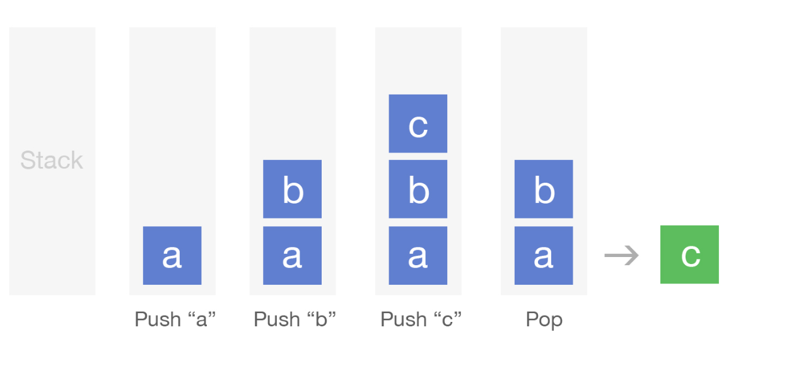

# Implement A Queue Using Two Stacks

In another interview question we explained what a queue is and how to implement one using
a linked list. Now we'll provide a solution to a common interview question, which is how
to implement a queue using two stacks.

A stack is a data structure where items can be added to a collection and removed from it
just like in a queue, except the difference is the order in which they are removed.
In a stack, the last item added will be the first item removed (last in, first out).
Stacks usually have two basic methods, push, which adds an item into the stack, and pop,
which "pops off" the top item from the stack. 

You can think of a stack like a physical stack of books: to add a new book to the stack
you simply place the book on top, and then when you want to make the stack smaller you
start removing books from the top of the stack.

### Example of Stack Operations:

