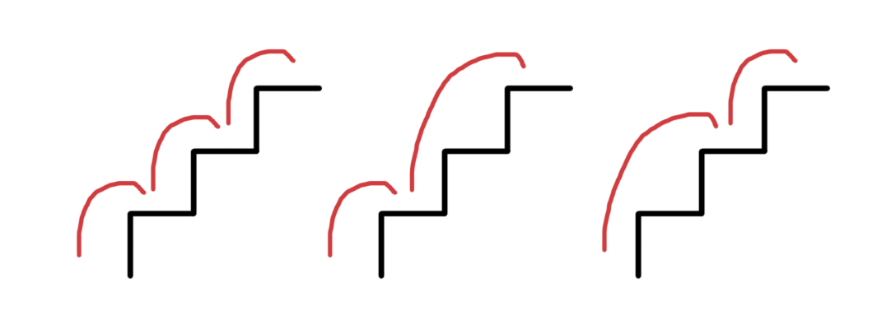

# Counting Steps Using Recursion

### Step-by-Step Solution for Step Counting Using Recursion

A lecturer at Hack Reactor made this comment on Quora in response to a question
about preparing for the Hack Reactor admission's challenge:

	One big thing that will help you: get intimately familiar with the concepts
	of recursion and JavaScript closures ... they will come up early in your
	interactions with Hack Reactor (and are just great things to understand
	in general).

Below we'll cover a clever question that we'll solve using recursion.
In a previous post we covered some questions regarding closures.

### Sources

[Quora](https://www.quora.com/How-did-you-prepare-for-Hack-Reactors-admissions-challenge)
[Glassdoor](https://www.glassdoor.com/Interview/You-are-climbing-a-stair-case-Each-time-you-can-either-make-1-step-or-2-steps-The-staircase-has-n-steps-In-how-many-dist-QTN_133071.htm)

### Question

Suppose you want climb a staircase of N steps, and on each step you can take
either 1 or 2 steps. How many distinct ways are there to climb the staircase?
For example, if you wanted to climb 4 steps, you can take the following
distinct number of steps:

	1) 1, 1, 1, 1
	2) 1, 1, 2
	3) 1, 2, 1
	4) 2, 1, 1
	5) 2, 2

So there are 5 distinct ways to climb 4 steps. We want to write a function, using
recursion, that will produce the answer for any number of steps.

### Solution

We'll try to build up a list of solutions for N starting from the smallest staircase.
If we want to climb a staircase of 1 step (N = 1), then we can only take 1 step to
reach the top. Therefore, the solution when N = 1 is 1. If we want to climb a
staircase of 2 steps (N = 2), we can take either 2 steps, or 1 step and 1 step to
reach the top. So for N = 2, the solution is 2.

N = 1
Solution = 1

N = 2
Solution = 2

What about 3 steps? 

