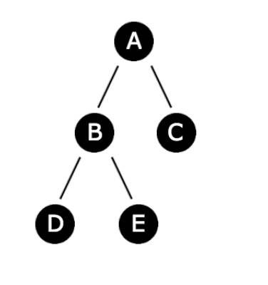
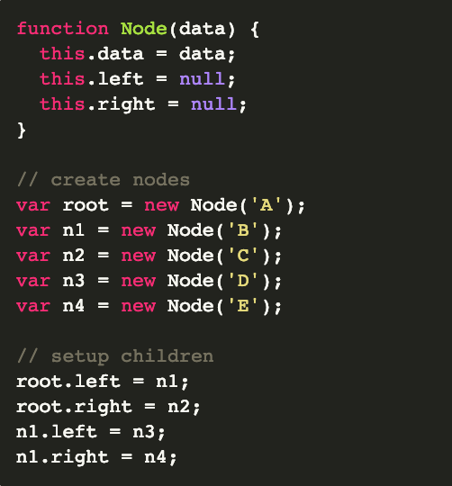
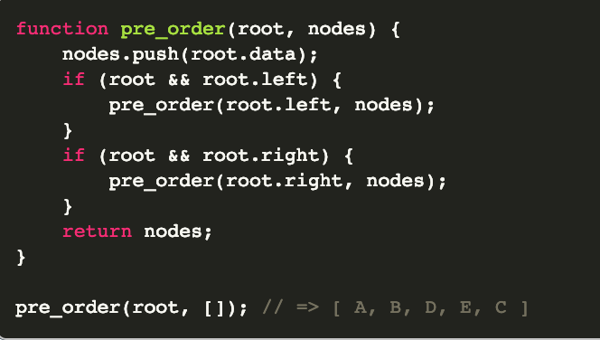
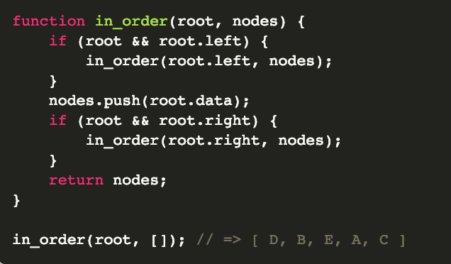

# Traverse A Simple Binary Tree

Tree traversal is the process of visiting each node in a tree, such as a
binary tree or binary search tree, exactly once. There are several effective
traversal algorithms which I will cover below.

All of the algorithms below will implement Node objects I create, which
were covered in a previous algorithm on linked lists. Although, I will be
slightly changing the code for the nodes. The tree I will be operating on
looks like the following:

And I can assume the tree is properly constructed via the following code
which sets up nodes and links them to their proper child nodes:

##### Pre-order

A pre-order traversal on a tree performs the following steps starting from
the root:

	1) Return the root node value.
	2) Traverse the left subtree by recursively calling the pre-order function.
	3) Traverse the right subtree by recursively calling the pre-order function.

For the tree above, performing a pre-order traversal would output the node
values in the following order:

	A, B, D, E, C

For the actual code implementation, we will be maintaining an array
for the order of the nodes:

##### In-order

An in-order traversal on a tree performs the following steps starting
from the root:

	1) Traverse the left subtree by recursively calling the in-order
	function.
	2) Return the root node value.
	3) Traverse the right subtree by recursively calling the
	in-order function.

For the tree above, performing an in-order traversal would output
the node values in the following order:

	D, B, E, A, C

