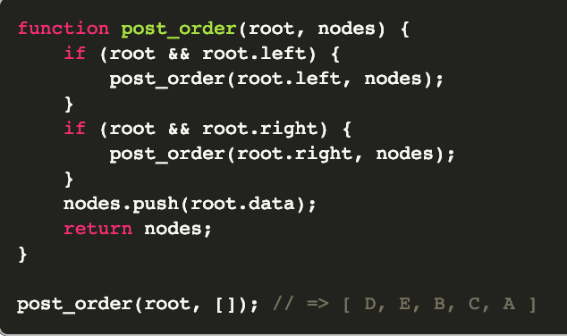
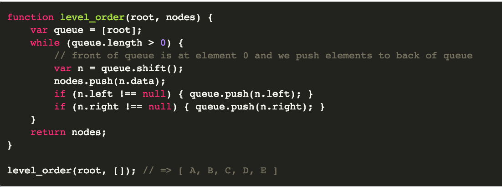

# Traverse A Simple Binary Tree

Tree traversal is the process of visiting each node in a tree, such as a
binary tree or binary search tree, exactly once. There are several effective
traversal algorithms which I will cover below.

All of the algorithms below will implement Node objects I create, which
were covered in a previous algorithm on linked lists. Although, I will be
slightly changing the code for the nodes. The tree I will be operating on
looks like the following:

And I can assume the tree is properly constructed via the following code
which sets up nodes and links them to their proper child nodes:

### Pre-order

A pre-order traversal on a tree performs the following steps starting from
the root:

	1) Return the root node value.
	2) Traverse the left subtree by recursively calling the pre-order function.
	3) Traverse the right subtree by recursively calling the pre-order function.

For the tree above, performing a pre-order traversal would output the node
values in the following order:

	A, B, D, E, C

For the actual code implementation, we will be maintaining an array
for the order of the nodes:

### In-order

An in-order traversal on a tree performs the following steps starting
from the root:

	1) Traverse the left subtree by recursively calling the in-order
	function.
	2) Return the root node value.
	3) Traverse the right subtree by recursively calling the
	in-order function.

For the tree above, performing an in-order traversal would output
the node values in the following order:

	D, B, E, A, C

You can see that the only difference between the code for the in-order
vs. pre-order traversal is where the appending of the node value is placed in
the code. For post-order traversal below, that will be the only change as well.

A good way to remember when to return the node value (or append the node value
to an array) is, for pre-order do it first, for in-order do it between the left
and right traversal, and as you'll see below, for post-order do it after
traversing the left and right subtrees.

### Post-order

A post-order traversal on a tree performs the following steps starting from
the root:

	1) Traverse the left subtree by recursively calling the post-order function.
	2) Traverse the right subtree by recursively calling the post-order function.
	3) Return the root node value.

For the tree above, performing a post-order traversal would output the node
values in the following order:

	D, E, B, C, A

### Level-order

A level-order traversal on a tree performs the following steps starting
from the root:

	1) Add the root to a queue.
	2) Pop the last node from the queue, and return its value.
	3) Add all children of popped node to queue, and continue from step 2 until queue is empty.

For the tree above, performing a level-order traversal would output the node
values in the following order:

A, B, C, D, E

### Applications of tree traversals

The algorithms above have several use cases in software and development. Below is
a list of some of these common cases:

	1) To construct any binary tree, you need the in-order traversal array of nodes and either a pre-order or post-order array.
	2) A binary search tree can be constructed using only its pre-order traversal array.
	3) The in-order traversal of a binary search tree produces the elements in sorted order.
	4) You can perform a breadth-first search on a tree using a level-order traversal.

