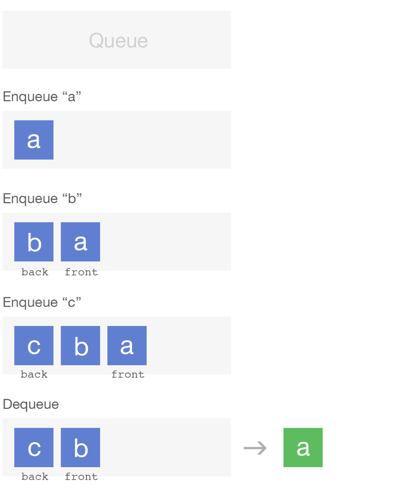

# Implement a queue using a linked list

A queue is an abstract data structure where items can either be added to a
collection or removed from a collection, enqueuing and dequeuing, respectively.
A queue is similar to a physical line of people: people can be added to the
end of the line (enqueuing), and to make the line smaller, people are removed
from the front of the line (dequeuing). We're going to implement a queue using
a linked list and we'll be using some code we've written in a previous
solution. 

Another term used to describe queues is FIFO, which stands for first in,
first out. It is a data structure where the first elements added to the
collection will be the first removed.

### Example

We want our queue to have two methods, enqueue X, which will add element X to
the end of the queue, and a dequeue method which will remove the current first
item from the queue. We don't need to specify what we want to dequeue because
the method always returns the first element from the queue. Here is an example
of a few operations we want our queue to be able to perform.

