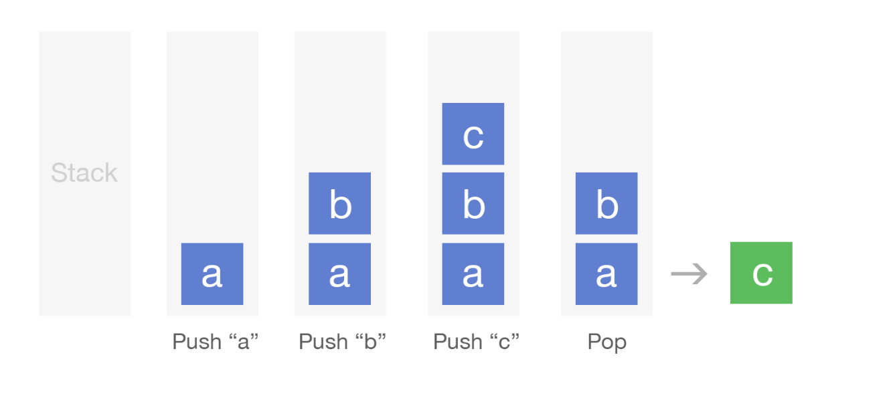

# Implement a queue using two stacks

In another interview question we explained what a queue is and how to implement
one using a linked list. Now we'll provide a solution to a common interview
question, which is how to implement a queue using two stacks.

A stack is a data structure where items can be added to a collection and removed
from it just like in a queue, except the difference is the order in which they
are removed. In a stack, the last item added will be the first item removed
(last in, first out). Stacks usually have two basic methods, push, which adds an
item into the stack, and pop, which "pops off" the top item from the stack. 

You can think of a stack like a physical stack of books: to add a new book to
the stack you simply place the book on top, and then when you want to make the
stack smaller you start removing books from the top of the stack.

### Example of stack operations

### Algorithm for queue using two stacks

For example: Suppose we push "a", "b, "c" to a stack. If we are trying to
implement a queue and we call the dequeue method 3 times, we actually want the
elements to come out in the order: "a", "b, "c", which is in the opposite order
they would come out if we popped from the stack. So, basically, we need to access
the elements in the reverse order that they exist in the stack. The following
algorithm (located in TwoStackQueue.js) will implement a queue using two stacks.

### Running time

The worst case running time for implementing these operations using stacks is
O(n) because you need to transfer n elements from stack 1 to stack 2 when a
dequeue method is called. Pushing to stack 1 is simply O(1).
